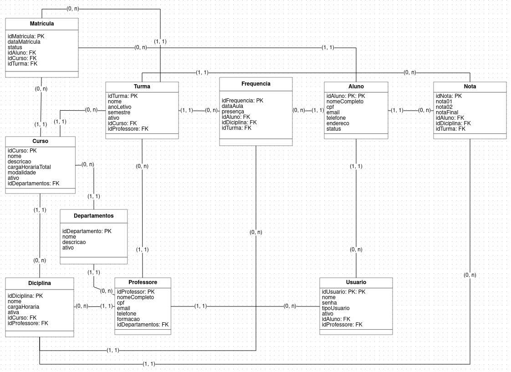

# Trabalho-A2-Backend
    Sistema Acadêmico – API Backend

# Tecnologias Utilizadas
    Node.js 
    Express.js 
    MongoDB + Mongoose 
    Yup  
    Nodemon  
    Dotenv  

# Descrição do Sistema
    Este sistema acadêmico oferece uma estrutura completa para gerenciamento escolar/universitário.
    Ele contempla os fluxos principais:

        Cadastro e gerenciamento de alunos 
        Cadastro de professores 
        Criação e administração de cursos 
        Controle de disciplinas 
        Organização de turmas 
        Registro de notas 
        Registro de frequência 
        Controle de matrículas 
        Gerenciamento de usuários do sistema (aluno/professor/admin) 

# Estrutura de Pastas da API
    /controllers
        alunoController.js
        professorController.js
        cursoController.js
        turmaController.js
        disciplinaController.js
        matriculaController.js
        notaController.js
        frequenciaController.js
        departamentoController.js
        usuarioController.js

    /models
        alunoModel.js
        professorModel.js
        cursoModel.js
        turmaModel.js
        disciplinaModel.js
        matriculaModel.js
        notaModel.js
        frequenciaModel.js
        departamentoModel.js
        usuarioModel.js

    /validators
        alunoValidators.js
        professorValidators.js
        cursoValidators.js
        turmaValidators.js
        disciplinaValidators.js
        matriculaValidators.js
        notaValidators.js
        frequenciaValidators.js
        departamentoValidators.js
        usuarioValidators.js
        indexValidators.js

# Endpoints da API

    Alunos
    Método	 Endpoint	    Descrição
    GET      /alunos	    Lista todos
    GET      /alunos/:id	Busca por ID
    POST     /alunos	    Cria aluno
    PUT      /alunos/:id	Atualiza
    DELETE   /alunos/:id	Remove  

    Você replicará este padrão para todos os módulos:

    /professores
    /cursos
    /disciplinas
    /turmas
    /matriculas
    /notas
    /frequencias
    /departamentos
    /usuarios

# Exemplos de requisições

    1. Alunos
    GET /alunos

    Resposta
        {
            "idAluno": "67a1e5c87a03",
            "nomeCompleto": "João da Silva",
            "cpf": "12345678900",
            "email": "joao@email.com",
            "telefone": "99999-0000",
            "endereco": "Rua A, 123",
            "status": true
        }

    GET /alunos/:id

    Resposta
        {
            "idAluno": "67a1e5c87a03",
            "nomeCompleto": "João da Silva",
            "cpf": "12345678900",
            "email": "joao@email.com",
            "telefone": "99999-0000",
            "endereco": "Rua A, 123",
            "status": true
        }

    POST /alunos

    Requisição    
        {
            "nomeCompleto": "Maria Oliveira",
            "cpf": "98765432100",
            "email": "maria@email.com",
            "telefone": "98888-1111",
            "endereco": "Av Central, 500",
            "status": true
        }
    Resposta
        {
            "message": "Aluno criado com sucesso",
            "idAluno": "67a1ffc72a11"
        }

    PUT /alunos/:id  

    Requisição
        {
            "telefone": "90000-1234",
            "status": false
        }

    POST /professores

    Requisição
        {
            "nomeCompleto": "Carlos Mendes",
            "cpf": "12312312312",
            "email": "carlos@escola.com",
            "telefone": "98888-7777",
            "formacao": "Mestre em Matemática",
            "idDepartamentos": "6799bb21213aa"
        }
    Resposta  
        {
            "message": "Professor criado com sucesso",
        }  

# Diagrama Entidade-Relacionamento

# Instalação e Configuração
## 1. Clonar o repositório

    git clone [Link do Repositório](https://github.com/AlanVinicius357/Trabalho-A2-Backend)

## 2. Instalar dependências

    npm install

## 3. Criar arquivo .env
 
    DB_HOST = ###
    DB_USER = ###
    DB_PASS = ###
    DB_NAME = ###

## 4. Rodar o servidor

    npm start
                
# Comunicação com o Banco de Dados
### O sistema utiliza o Mongoose para conectar com o MongoDB

    const mongoose = require('mongoose')
    const dotenv = require('dotenv').config()

    const DB_HOST = process.env.DB_HOST
    const DB_USER = process.env.DB_USER
    const DB_PASS = process.env.DB_PASS
    const DB_NAME = process.env.DB_NAME

    const url = `mongodb+srv://${DB_USER}:${DB_PASS}@${DB_HOST}/${DB_NAME}?retryWrites=true&w=majority&appName=Cluster0`

    mongoose.connect(url)
    .then(() => {
        console.log("Conectado ao MongoDB")
    })
    .catch(err => {
        console.log("Erro ao conectar no banco MongoDB: ", err)
    })

